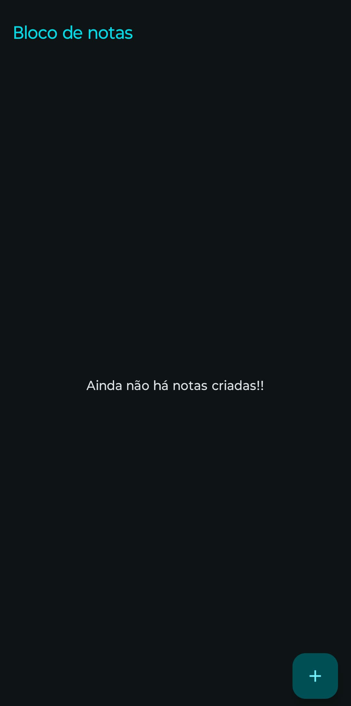
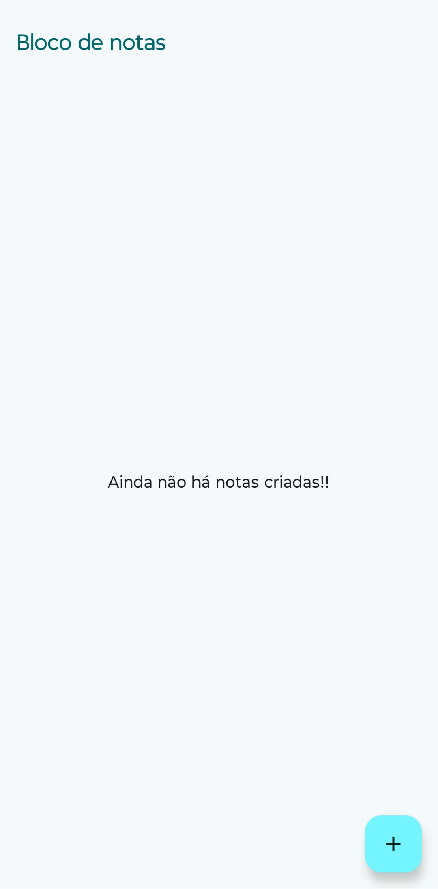
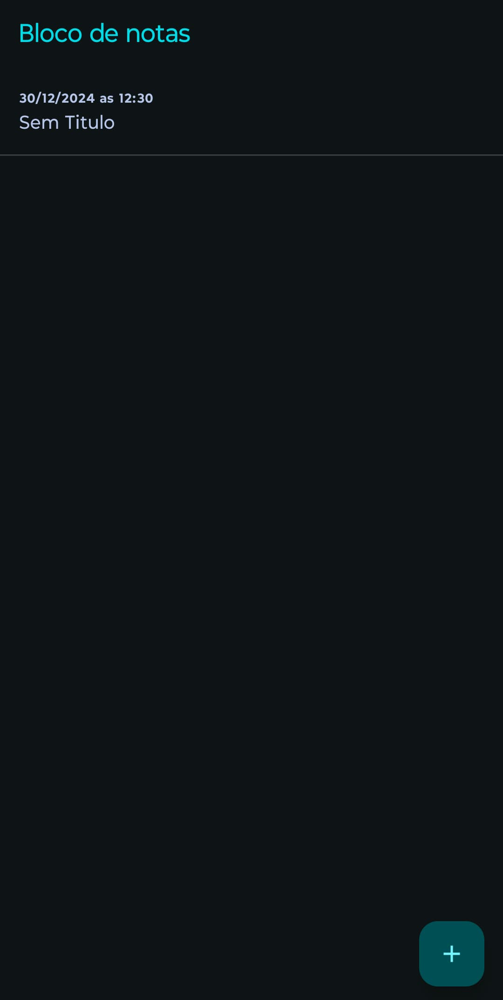
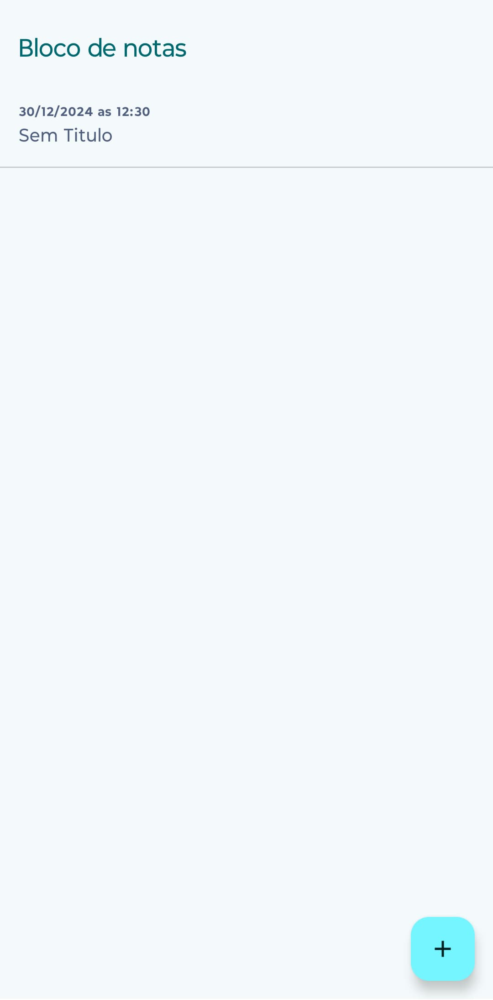
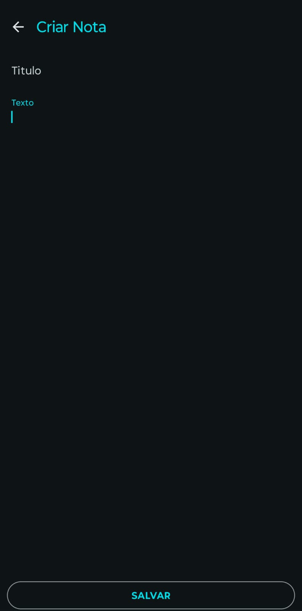
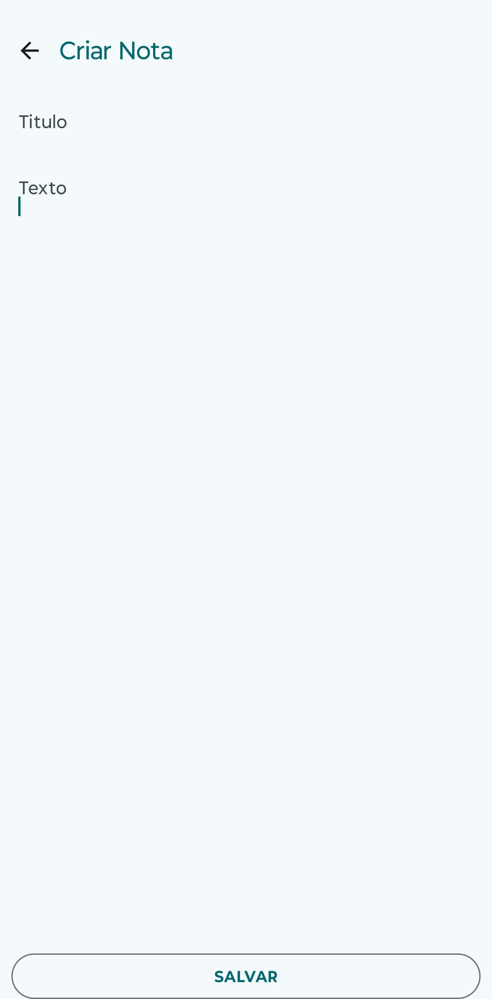
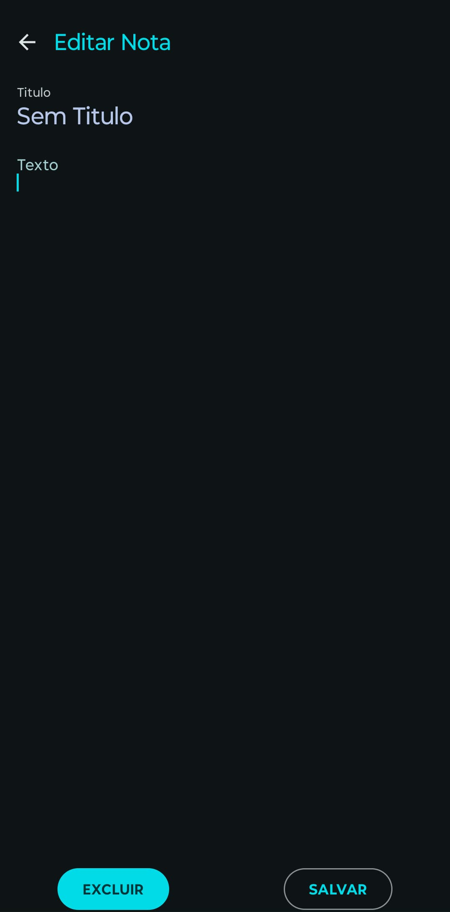
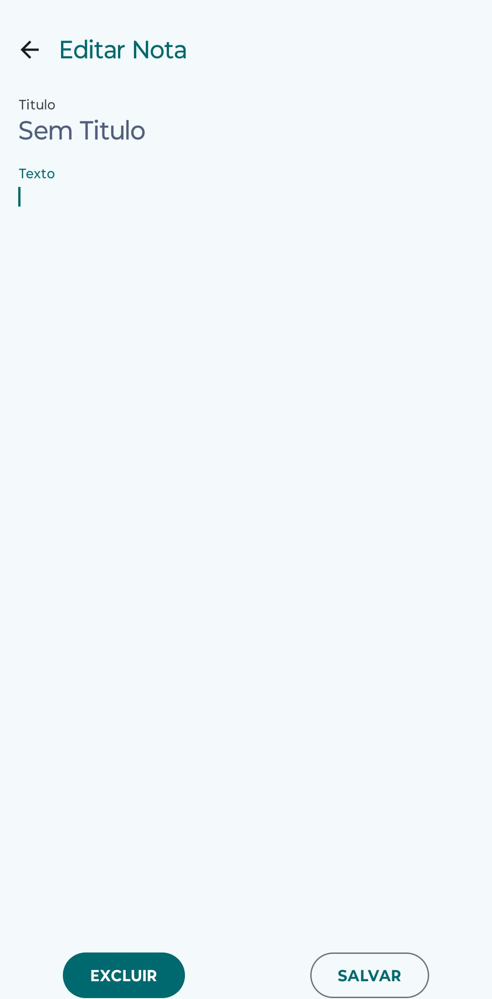

Bloco de notas

É um app feito para o apredizado para o desenvolvimento android

este app é simples , contendo funções basicas da biblioteca do android como:
- Scafford
- Floating Action Button
- Top app bar
- Lazy Column
- List items
- Shared Preferences

Telas:

Home Vazia

|---|---|
|Home1 dark|Home1 Light|
|||
|---|---|
|Home2 dark|Home2 Light|
|||
|---|---|
|Criar dark|Criar Light|
|||
|---|---|
|Editar dark|Editar Light|
|||
|---|---|

